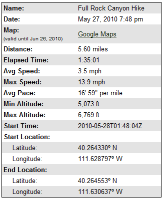
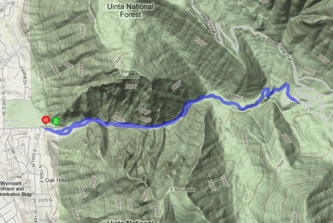
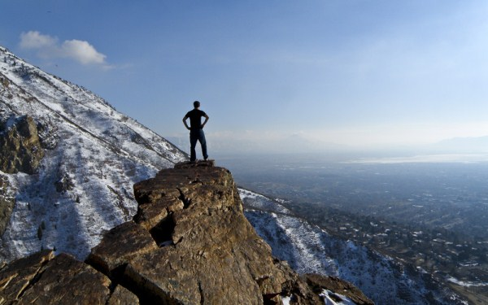
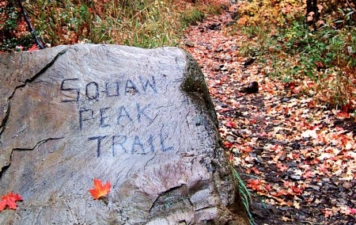
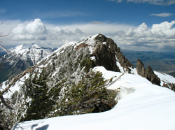
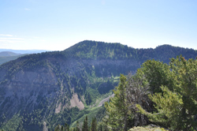
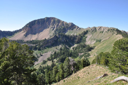
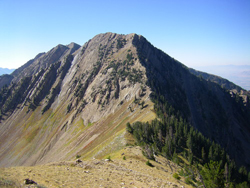
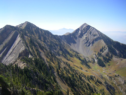
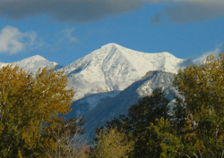

# Rock Canyon Hikes & Maps

    
    

        

            Check out the following three hikes. There are more on the way!
        

    

# Full Rock Canyon Hike

    

        

            
        

    

    

        

            
        

        

            Full Rock Canyon Hike
        

    

# Squaw Peak Hike

    

        Squaw Peak
         Ele­va­tion: 7,877
         Loca­tion: Wasatch Range, Utah
    

        Per­haps the most pop­u­lar smaller peak in Utah County is Squaw Peak, at the mouth of Rock Canyon (just above the Provo Tem­ple and the Mis­sion­ary Train­ing Cen­ter). From the west you can see Squaw gen­tly ris­ing from north to south, but the south side drops abruptly to the canyon bot­tom, cre­at­ing a fero­cious south face.
    

    

    

        

            
        

        

            Squaw Peak
        

    

    

    

        Take the trail which heads up Rock Canyon (which is paved for the first bit).You will cross five bridges and then con­tinue about ¼ mile until you see the Squaw Peak Trail rock on the left (north).  Take a good look at the photo of the rock with the words “Squaw Peak Trail” engraved on it.  That’s your trail marker!
    

    

    

        

            
        

    

    

    

        As you make your way to the north, you’ll have a fine view of Mt. Tim­pano­gos. The trail turns and gets steeper as you fin­ish the climb to the sum­mit, where you are greeted with an impres­sive view back down to the Rock Canyon trail­head, nearly 3,000 feet straight down! Take in nearly-360-degree views on Squaw Peak (7,876 ft.) from which you can see Utah Lake, Tim­pano­gos and Provo Peak, a sel­dom vis­ited 11,000 foot peak.
    

    

        Tak­ing this route up Squaw Peak is approx­i­mately three miles each way from the main Rock Canyon trail, climb­ing about 3,000 feet total. Expect round-trip hik­ing times of three to four hours from the trail­head park­ing lot.
    

    

# Five Peaks (back side of Rock Canyon)

    

        <b>Cascade Mountain</b>
         Ele­va­tion: 10,908 feet
         Loca­tion: Wasatch Range, Utah
    

        This is the large moun­tain south of Provo Canyon. It has four seper­ate peaks along its sum­mit ridge. The south sum­mit is 147 feet lower than the actual sum­mit. This is con­sid­ered one of the harder peaks in the Wasatch because there is really no easy way to the top. The first thing that is notice­able about Cas­cade Moun­tain is that there are sev­eral steep couloirs run­ning down its west face. These couloirs make excel­lent spring snow climbs. There are two routes that hik­ers gen­er­ally use. The Bun­nels Fork route is prob­a­bly the most scenic. It is still a long day with over 5,000 feet of ele­va­tion gain. The sec­ond route is the south ridge from Dry Fork trail­head on Squaw Peak Road. The north­east ridge is another pos­si­bil­ity, but this would be a very long day.
    

    

    

        

            
        

        

            Cas­cade Moun­tain
        

    

    

        <b>Light­ning Peak</b>
         Ele­va­tion: 10,056 feet
         Loca­tion: Wasatch Range, Utah
    

        Light­ning Peak is located on the ridge­line north­east of Shin­gle Mill Peak. The Great West­ern Trail pro­vides access to this peak. Also Shin­gle Mill Canyon or Water Hol­low can be hiked from the South Fork of Provo Canyon. The trail climbs to a high moun­tain ridge­line called Windy Pass. Light­ning Peak will be directly west of the pass. You can also climb Light­ning Peak from the Dry Fork Trail­head on Squaw Peak Road. This would be a long day hike. The moun­tain can be seen in the dis­tance above many of the smaller peaks near Big Springs Hol­low to the northwest.
    

    

    

        

            
        

        

            Lightning Peak
        

    

    

        <b>Shin­gle Mill Peak</b>
         Ele­va­tion: 10,690 feet
         Loca­tion: Wasatch Range, Utah
    

        Shin­gle Mill Peak is located north of Free­dom Peak on the same ridge­line. The stan­dard route for climb­ing the moun­tain is from the Dry Fork Trail­head on Squaw Peak Road. The moun­tain has lines of ter­races run­ning across its slopes. The trail tra­verses these ter­races until it gets to the sad­dle with Shin­gle Mill Peak and Free­dom Peak. Now all you have to do is fol­low the ridge up to the sum­mit. The last part is steep but not dif­fi­cult. You might as well climb Free­dom Peak while you are there. Shin­gle Mill Peak can also be reached from Big Springs Trail. The dis­tance from the park­ing lot to the Cas­cade sad­dle is just over 5 miles. The route from the Big Springs trail is longer than the route from Dry Fork.
    

    

    

        

            
        

        

            Shingle Mill Peak
        

    

    

        <b>Freedom Peak</b>
         Ele­va­tion: 10,801 feet
         Loca­tion: Wasatch Range, Utah
    

        This moun­tain was offi­cially named on June 9, 2005. One of the largest Inde­pen­dence Day cel­e­bra­tions, The Free­dom Fes­ti­val, takes place in Provo. No doubt this had influ­ence on vot­ing to name it Free­dom Peak. It is located on the ridge­line north of Provo Peak. The short­est route to the top is from the Dry Fork Trail­head on Squaw Peak Road. This is the same approach for Shin­gle Mill Peak which you could eas­ily com­bine with Free­dom Peak. The final part up the moun­tain has some nice scram­bling along the ridge­line. You can also con­tinue on the ridge toward Provo Peak.
    

    

    

        

            
        

        

            Freedom Peak
        

    

    

        <b>East Provo Peak</b>
         Ele­va­tion: 11,044 feet
         Loca­tion: Wasatch Range, Utah
    

        East Provo Peak is located to the east of Provo Peak. It is only twenty-four feet lower and climbed less often than Provo Peak. They are con­nected by a ridge­line and a sad­dle. To tra­verse this ridge you will lose ele­va­tion before climb­ing up to the sum­mit. This is a steep hike that has some loose rock. East Provo has enough promi­nence to qual­ify as a sep­a­rate peak. It is climbed by peo­ple wish­ing to com­plete the Wasatch Eleven­ers. East Provo Peak can also be reached by a long ridge hike from Free­dom Peak far­ther north. This route is usu­ally accessed from Squaw Peak Road.
    

    

    

        

            
        

        

            East Provo Peak
        

    

    

        <b>Provo Peak</b>
         Ele­va­tion: 11,068 feet
         Loca­tion: Wasatch Range, Utah
    

        Provo Peak is one of the high­est moun­tains above the city of Provo. The route used the most is the west ridge. The trail­head for the west ridge starts from Squaw Peak Road. This road is paved to Rock Creek Camp­ground and then turns into a gravel dirt road after that. The route is dif­fi­cult to find at the begin­ning. You’ll be walk­ing up steep slopes and along ter­races. Once you get to the ridge­line the trail will be easy to see and fol­low. You can also get there from the Dry Fork Trail­head by tak­ing the same route to Free­dom Peak and con­tin­u­ing south along the ridge.
    

    

    

        

            
        

        

            Provo Peak
        

    

